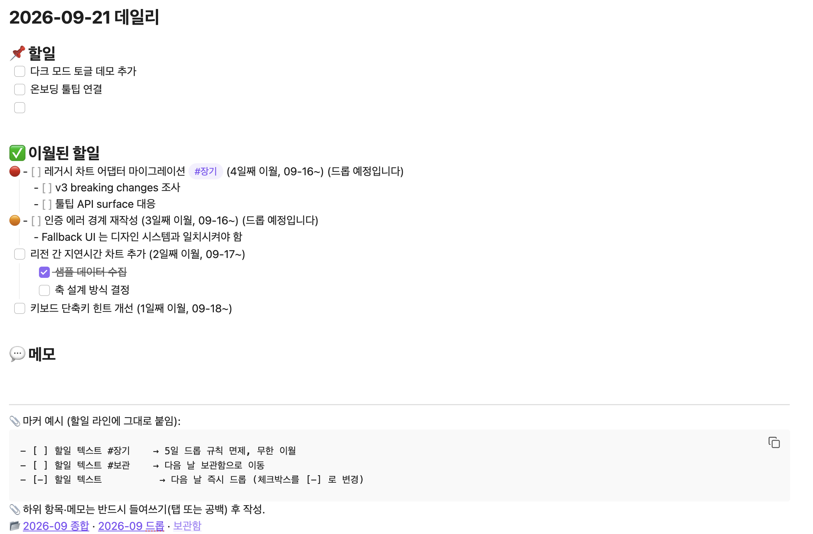
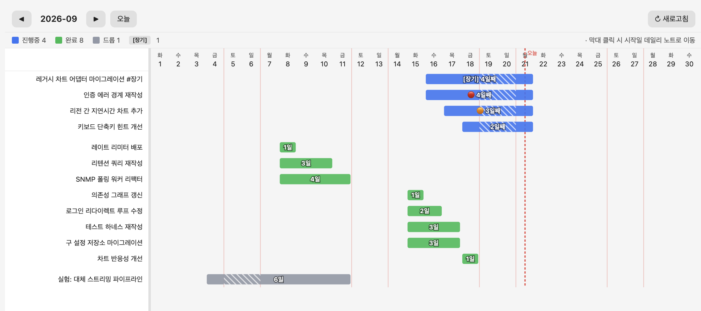
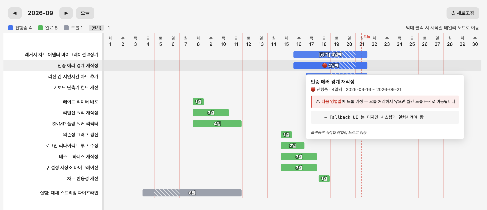
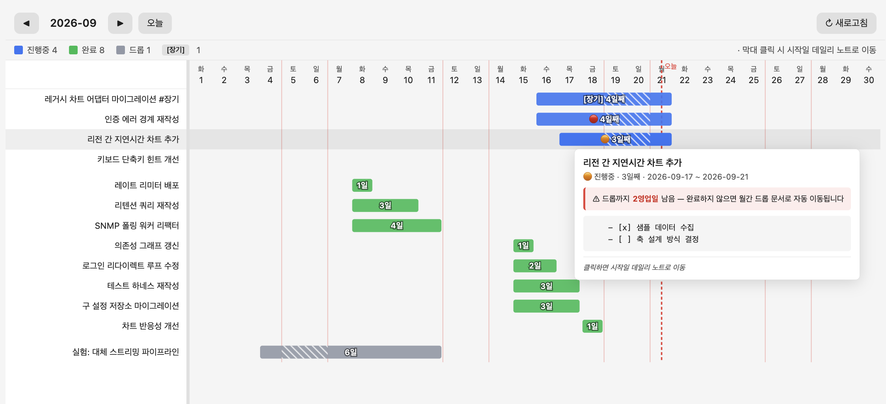
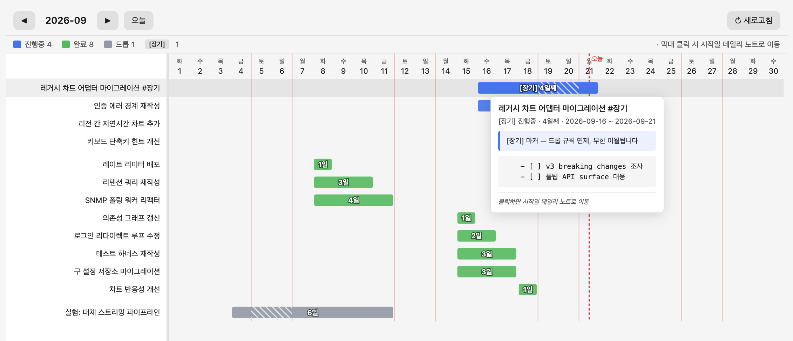
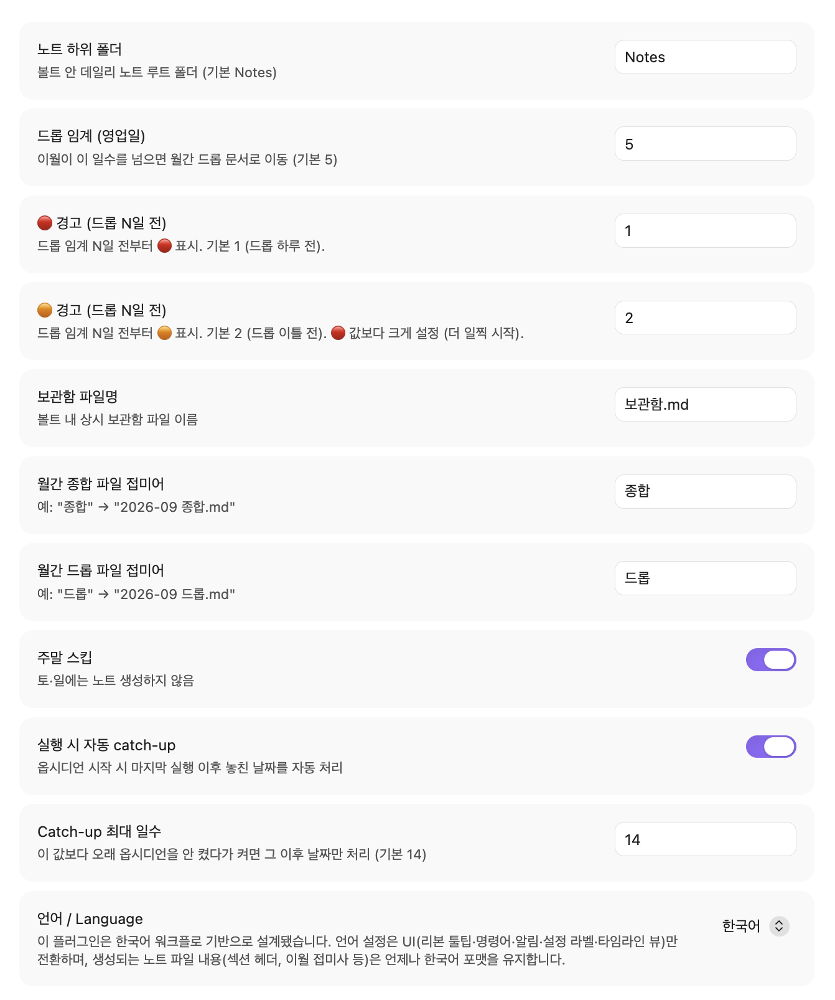

# Obsidian Daily Note Manager

Automates the daily-note task lifecycle in Obsidian: carry, warn, drop, archive.

- Yesterday's unfinished tasks land in today's "Carried over" section
- Each carried task shows how many days it's been open
- Days 3–4: 🟠 / 🔴 warnings appear
- Day 5+: task moves to the month's drop document
- Completed tasks log into the monthly summary
- Ribbon calendar icon: this month's Gantt chart

## What a daily note looks like



Yesterday (March 19) had these tasks:

```markdown
## 📌 할일
- [ ] Clean up the API response schema
- [x] PR review
```

Today's note is generated automatically like this:

```markdown
## 📌 할일

## ✅ 이월된 할일
- [ ] Clean up the API response schema (2일째 이월, 03-19~)

## 💬 메모
```

What happens next to each task:

- Days 3–4: prefix flips to 🟠 / 🔴 with a "will be dropped soon" note
- Day 5+: task disappears from today's note → moves to `2026-03 드롭.md`
- The completed "PR review": logged in `2026-03 종합.md` for month-end review

## Overriding the policy

Three markers on a task line change how it's handled:

- `#장기` — never dropped, keeps carrying over. Use for long-running project items.
- `#보관` — on the next run, moves to `보관함.md`. Use for reference items you want to keep without marking complete or cancelled.
- `- [-]` — dropped immediately. Use for tasks you decided not to do.

## Timeline view

Left ribbon → calendar icon → this month's Gantt chart.

- Bar colors: blue in-progress / green complete / gray dropped
- Click a bar → jump to the daily note where the task first appeared
- Weekend dividers and a today marker on the axis
- Hover a bar → tooltip with the full task text and its subtasks/notes



Hover a bar for the full task details, subtasks, and drop countdown:

| Red — drops next business day | Orange — with countdown | Long-term — exempt |
|---|---|---|
|  |  |  |

The monthly summary document also embeds a Mermaid Gantt snapshot that refreshes each day.

- View it from Reading mode without opening the custom view
- Renders on mobile

## Folder layout

Files the plugin creates and manages:

```
Notes/
└── 2026-03/
    ├── 4주차/
    │   ├── 📅 2026-03-19.md
    │   └── 📅 2026-03-20.md
    ├── 2026-03 종합.md
    └── 2026-03 드롭.md
보관함.md
```

- Weeks start on Monday. The week containing day 1 is week 1.
- New month/year folders are created automatically.

## When it runs

- While Obsidian is open: checks every 60 seconds whether today's note exists
- After a gap (Obsidian was closed for days): catches up by processing missed business days in order, up to 14 by default

## Install

**Beta via BRAT**

1. Install [BRAT](https://github.com/TfTHacker/obsidian42-brat) from community plugins.
2. Open the BRAT ribbon icon → "Add Beta Plugin" → paste `KiimDoHyun/obsidian-daily-note-manager`.
3. Enable "Daily Note Manager" under Settings → Community plugins.

**Manual**

Download `main.js`, `manifest.json`, and `styles.css` from the [Releases](https://github.com/KiimDoHyun/obsidian-daily-note-manager/releases) page and drop them into `.obsidian/plugins/daily-note-manager/` inside your vault.

## Settings

Under Settings → Community plugins → Daily Note Manager:



- Notes subfolder (default `Notes`)
- Drop threshold in business days (default 5)
- 🔴 warning starts N business days before drop (default 1 → day before drop)
- 🟠 warning starts N business days before drop (default 2 → two days before drop)
  - Offsets scale with the drop threshold: if you change drop to 7, warnings shift to day 5/6 automatically
- Skip weekend on/off
- Max catch-up days on app load (default 14)
- **Language / 언어** — UI language (ribbon, commands, notices, settings labels, timeline view). Note file contents (section headers, carryover suffixes, monthly summary, etc.) always stay in Korean format regardless of this setting.

## Commands

From the command palette (`Cmd/Ctrl+P`):

- Create today's note
- Dry-run today's actions (no file writes)
- Force regenerate a specific date
- Recompute this month's summary header
- Refresh this month's timeline section
- Open timeline view
- Environment diagnostics

## When this plugin isn't a good fit

This plugin assumes daily notes are your task ledger. If that's not how you work:

- You keep long-running project tasks in daily notes — you'd need to tag every one with `#장기`. Query-based tools like [Tasks](https://publish.obsidian.md/tasks/) fit better.
- Files moving on their own makes you uneasy — drop and archive actually move files. If you only want carryover, [Rollover Daily Todos](https://github.com/lumoe/obsidian-rollover-daily-todos) is lighter.
- You manage tasks in project notes rather than daily notes.

## Development

See [CONTRIBUTING.md](./CONTRIBUTING.md).

## License

MIT

---

# 한국어

옵시디언 데일리 노트의 할일 라이프사이클(이월·경고·드롭·보관)을 자동화하는 플러그인.

- 어제 미완료 할일 → 오늘 노트의 "이월된 할일" 자리로 이동
- 이월된 항목: 며칠째 붙들고 있는지 숫자로 표시
- 3~4일째: 🟠 / 🔴 경고 마커
- 5영업일 초과: 그 달의 드롭 문서로 자동 이동
- 완료 항목: 월간 종합 문서에 로그로 축적
- 리본 달력 아이콘: 이번 달 간트 차트

## 실제 노트는 이렇게 생깁니다


어제 3월 19일 노트에 이런 항목이 남아 있었다고 하자.

```markdown
## 📌 할일
- [ ] API 응답 스키마 정리
- [x] PR 리뷰
```

오늘 자동으로 만들어지는 3월 20일 노트는 이렇게 보인다.

```markdown
## 📌 할일

## ✅ 이월된 할일
- [ ] API 응답 스키마 정리 (2일째 이월, 03-19~)

## 💬 메모
```

각 항목의 이후 처리:

- 3~4일째: 앞에 🟠 / 🔴 마커 + "드롭 예정입니다" 경고
- 5영업일 초과: 오늘 노트에서 사라짐 → `2026-03 드롭.md`로 이동
- 완료된 "PR 리뷰": `2026-03 종합.md`에 기록 → 월말 회고 자료

## 자동 처리에 개입하고 싶을 때

기본 정책을 덮어쓰는 마커 세 개.

- `#장기` — 며칠이 지나도 드롭되지 않는다. 오래 걸리는 프로젝트 항목에 붙인다.
- `#보관` — 다음 날 노트를 만들 때 `보관함.md`로 옮겨진다. 완료도 취소도 아닌, 참고용으로 남기고 싶은 항목에 쓴다.
- `- [-]` — 즉시 드롭 처리한다. 하려다 접은 항목을 이월 대상에서 뺄 때.

## 타임라인 뷰

좌측 리본 → 달력 아이콘 → 이번 달 간트 차트.

- 막대 색: 진행 중 파랑 / 완료 초록 / 드롭 회색
- 막대 클릭 → 해당 항목이 처음 등장한 데일리 노트로 이동
- 주말은 세로선, 오늘은 별도 마커
- 막대에 마우스 hover → 하위 항목·메모까지 상세 툴팁


막대에 hover 하면 전체 이름·하위 항목·드롭 카운트다운 확인:

| 🔴 (다음 영업일 드롭) | 🟠 (카운트다운) | [장기] (면제) |
|---|---|---|
|  |  |  |

월간 종합 문서에도 Mermaid 간트 스냅샷이 매일 자동 갱신된다.

- 별도 뷰 없이 종합 문서 스크롤로 확인
- 모바일에서도 렌더링

## 폴더 구조

플러그인이 만들고 관리하는 파일들.

```
Notes/
└── 2026-03/
    ├── 4주차/
    │   ├── 📅 2026-03-19.md
    │   └── 📅 2026-03-20.md
    ├── 2026-03 종합.md
    └── 2026-03 드롭.md
보관함.md
```

- 주차는 월요일 기준. 그 달의 1일이 포함된 주가 1주차.
- 월/년이 바뀌면 새 폴더가 자동 생성.

## 언제 실행되나

- 옵시디언 실행 중: 60초마다 오늘 노트 존재 여부 확인
- 며칠 만에 다시 열었을 때: 마지막 실행일부터 오늘까지 놓친 영업일을 순서대로 처리 (기본 최대 14일)

## 설치

**BRAT (베타)**

1. 커뮤니티 플러그인에서 [BRAT](https://github.com/TfTHacker/obsidian42-brat) 설치·활성화.
2. 좌측 리본의 BRAT 아이콘 → "Add Beta Plugin" → `KiimDoHyun/obsidian-daily-note-manager` 입력.
3. 설정 → 커뮤니티 플러그인에서 "Daily Note Manager" 활성화.

**수동 설치**

[Releases](https://github.com/KiimDoHyun/obsidian-daily-note-manager/releases)에서 `main.js`, `manifest.json`, `styles.css`를 받아 볼트의 `.obsidian/plugins/daily-note-manager/`에 넣는다.

## 설정

설정 → 커뮤니티 플러그인 → Daily Note Manager.


- 노트 하위 폴더 (기본 `Notes`)
- 드롭 임계일 (기본 5영업일)
- 🔴 경고 시작: 드롭 N일 전 (기본 1 → 드롭 하루 전)
- 🟠 경고 시작: 드롭 N일 전 (기본 2 → 드롭 이틀 전)
  - 드롭 임계일이 변경되면 경고 시점도 자동으로 따라감 (드롭 7일이면 5·6일째부터 경고)
- 주말 스킵 여부
- 앱 로드 시 catch-up 최대 일수 (기본 14일)
- **언어 / Language** — UI(리본·명령·알림·설정 라벨·타임라인 뷰) 언어. 노트 파일 내용(섹션 헤더·이월 접미사·월간 종합 등)은 이 설정과 무관하게 항상 한국어 포맷.

## 명령어

명령어 팔레트(`Cmd/Ctrl+P`).

- 오늘 노트 생성
- 오늘 실행 결과 미리보기 (dry-run)
- 특정 날짜 강제 재생성
- 이번 달 종합 재계산
- 이번 달 타임라인 새로고침
- 타임라인 뷰 열기
- 환경 진단

## 이 플러그인이 안 맞는 경우

데일리 노트를 태스크 장부처럼 쓰는 워크플로를 전제한다.

- 장기 프로젝트 항목을 데일리 노트에 그대로 두는 스타일 — `#장기`를 매번 붙여야 해서 번거롭다. [Tasks](https://publish.obsidian.md/tasks/)처럼 쿼리 기반 도구가 더 맞다.
- 파일이 자동으로 이동하는 게 불안한 경우 — 드롭·보관 동작이 실제 파일을 옮긴다. 이월만 원한다면 [Rollover Daily Todos](https://github.com/lumoe/obsidian-rollover-daily-todos)가 더 가볍다.
- 데일리 노트가 아니라 프로젝트 노트 중심으로 태스크를 관리하는 경우.

## 개발

개발 환경, 소스 구조, 릴리스 절차는 [CONTRIBUTING.md](./CONTRIBUTING.md) 참조.

## 라이선스

MIT.
